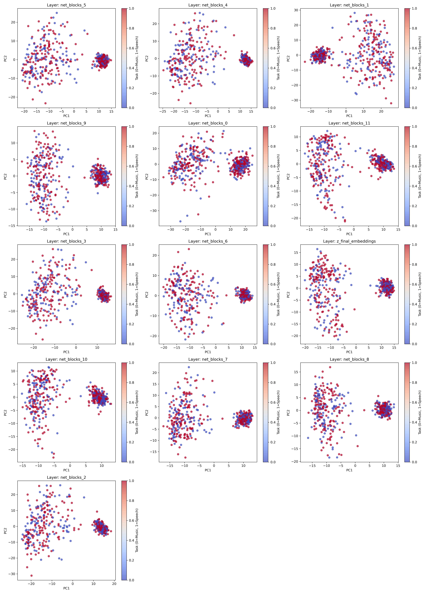
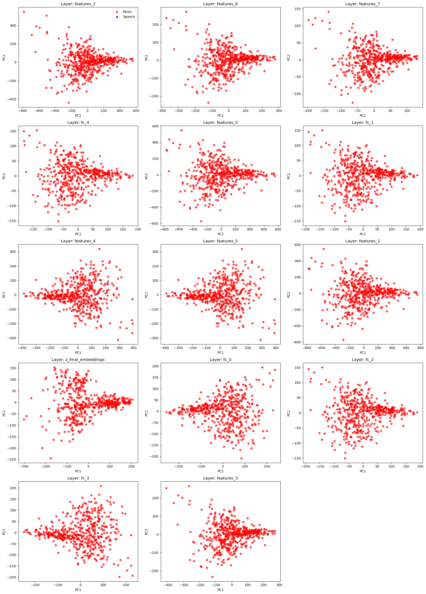
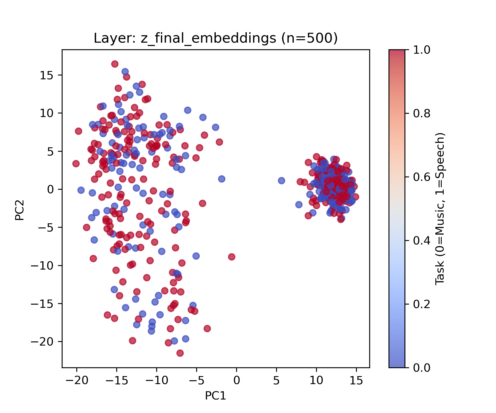
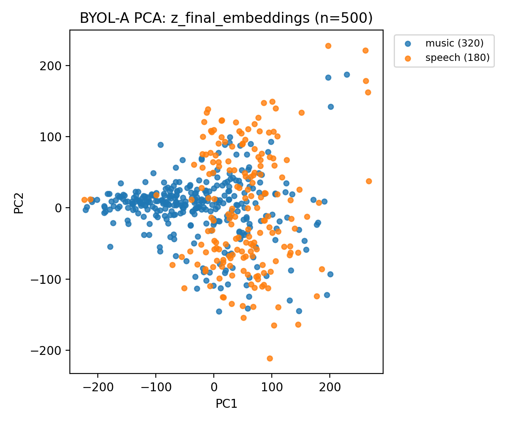

# supervised-vs-SSL
## Purpose

My research project explored the effectiveness of different supervised learning approaches on audio processing tasks, and looked for task specialization across their intermediate layers. 

## Context

Supervised learning is an approach to machine learning that uses labeled data, while self-supervised learning uses unlabeled data. Task specializaiton refers to when a neural network become tuned to specific tasks, such as identifying speech or music. Studying models across their layers can possibly provide insight into how the brain works.
The inputs for the models I used are log-mel spectrograms, which are time-frequency representations of audio with compressed amplitude.
The applications for this project are in improving spatial awareness in hearing aid and virtual reality algorithms.

## Methodology

I used PaSST as my SL model and BYOL-A as my SSL model. I used Google's Speech Commands dataset, the Free Music Archive, and DCASE environmental noise as my data.

For each model I wrote a preprocessing pipeline to:
1. adjusting audio settings to meet each model's requirements
2. added noise over speech & music audio, normalizing amplitude, removing silence without truncating words
3. converted those audio files into log-mel spectrograms stored as vectors

Then I did feature extraction of final and intermediate layer embeddings for both models. I extracted thousands of final embeddings, and only extracted 500 feature vectors for each layer of intermediate embeddings. PaSST has 13 layers, while BYOL-A has 14.

I looked at the intermediate layer embeddings to see if the models showed any signs of task specialization at any specific layer: 

  
   
  <em>Left: PaSST intermediate layer embeddings | Right: BYOL-A intermediate layer embeddings</em>

And I looked at the final embeddings to see how much the models differentiated between speech and music: 

  
   
  <em>Left: PaSST final layer embeddings | Right: BYOL-A final layer embeddings</em>

## Results

BYOL-A showed task specialization across layers and had lower accuracy. PaSST showed no task specialization and had slightly higher accuracy. Average classification accuracy was ~71% for BYOL-A and ~80% for PaSST. Both models performed better on word classification than music genre classification.

PaSST intermediate layers did not form distinct clusters between music and speech processing. BYOL-A showed significant separation between music and speech processing at early layers.

For additional information, read my research proposal and final report. Citations are given there too. 

 
